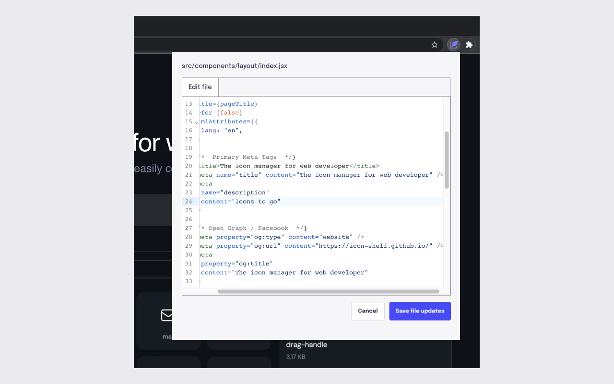

<h1 align="center">Source Patch</h1>
<h3 align="center">Edit source code of your website without leaving your tab.</h3>



Source Patch is a chrome extension that can let you quickly make alterations to the source code for a website.

While looking at your website or web app, you see a small error, either be it a text correction or a spacing fix.
With Source Patch you can make this alteration right within your tab. No need to pull in the source code and do all the setup.
Make the file changes to your source code using Source Patch and it will give a Pull request to GitHub with your changes.

Features

- Search file contents and update source code
- Automatically create a pull request to GitHub with your changes

For all feature requests or bug reports, please fill in an issue.

## :call_me_hand: Development

This app is built using [React](https://reactjs.org/) and [Typescript](https://www.typescriptlang.org/). We use [Vite](https://vitejs.dev/) for bundling and building.

### :zap: Quick Setup

1. Install all app dependencies.

   ```sh
   npm install
   ```

2. Start the development.

   ```sh
   npm run dev
   ```

3. Go to extensions tab in chrome, click load unpacked and choose `dist` folder in this repo.

### Building for Production

1. Package.

   ```sh
   npm run build
   ```

2. A dist folder would be created. In which your packaged app would be present.
